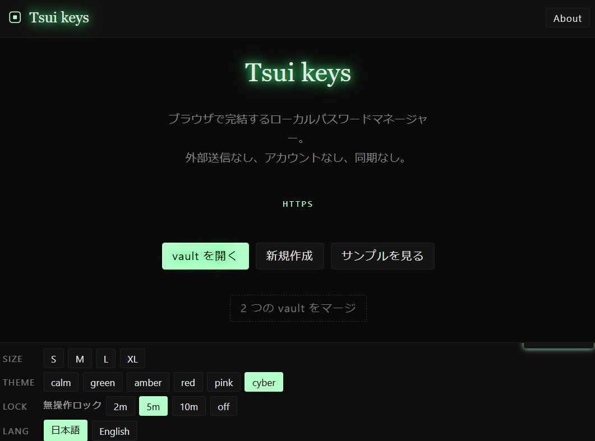
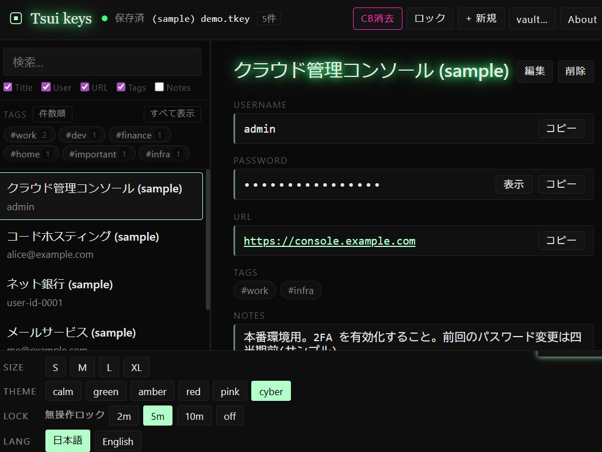
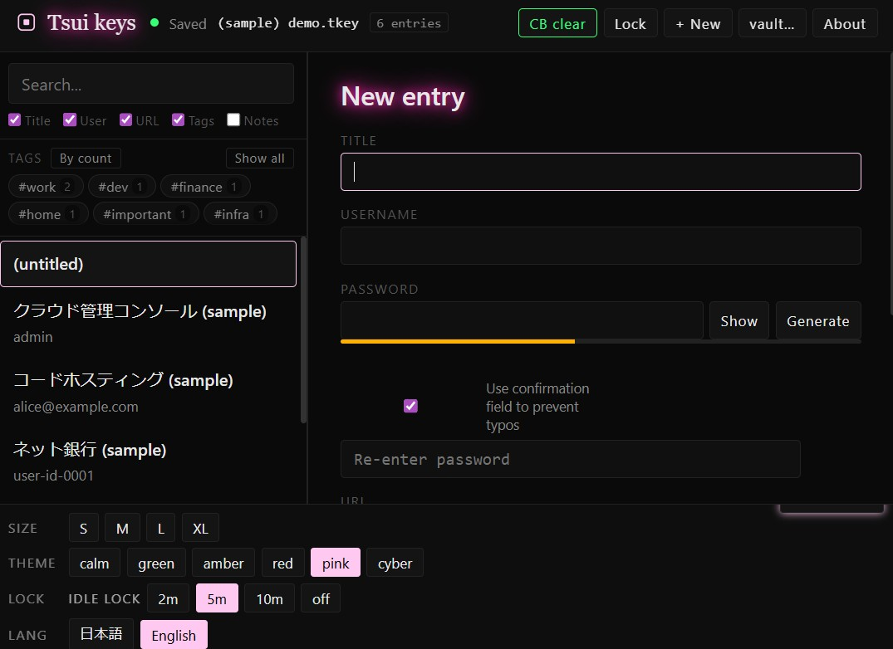
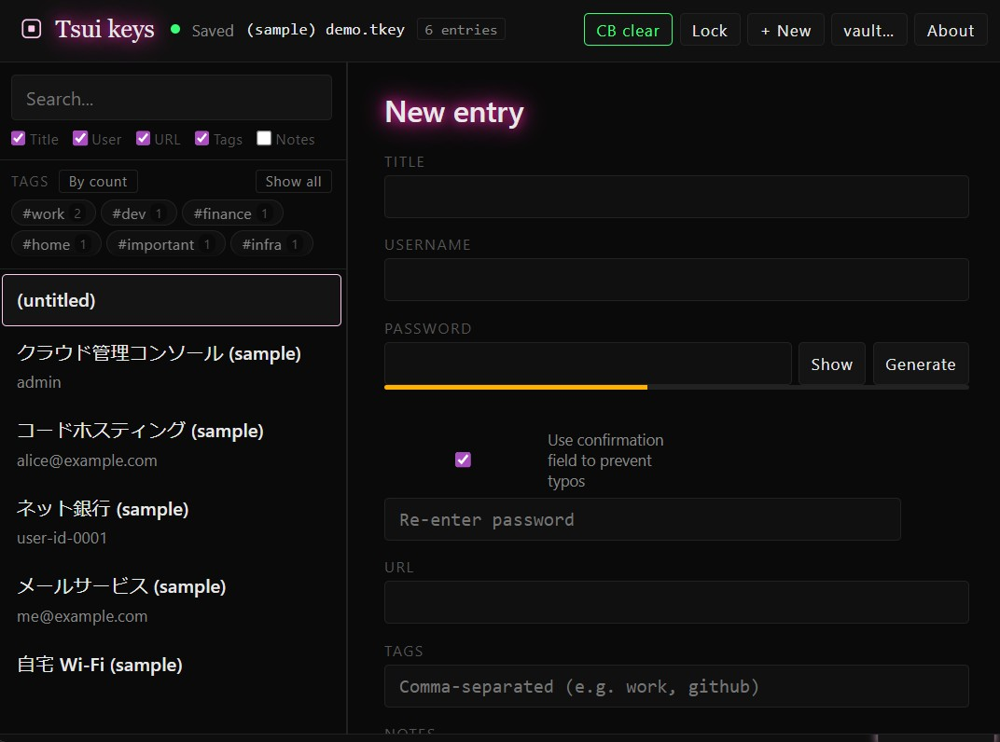

# Tsui keys

> ⚠ This is a machine-translated version of the original [README.md](README.md) (Japanese). For the most accurate and authoritative information, please refer to the original Japanese version.

A browser-only local password manager. No external transmissions, no accounts, no sync.

> When accessed via Cloudflare Pages, communication with Cloudflare occurs on first access and on app updates. After the app launches, the app itself does not transmit vault contents or user input externally.
> Note: informational pages such as the author's profile and the Tsui series landing page use Cloudflare Web Analytics for visit tracking (no cookies, no fingerprinting, no cross-site tracking).

Part of the [**Tsui series**](https://hajimetwi3.github.io/hajimetwi3/Tsui-series/).

---

## Web version (Cloudflare Pages, PWA-enabled)

Available at the following URL:  
[https://tsuikeys.pages.dev/](https://tsuikeys.pages.dev/)  

## Downloadable version

The latest version is distributed via the GitHub repository's Releases page.

- **Repository**: [https://github.com/hajimetwi3/Tsui-keys](https://github.com/hajimetwi3/Tsui-keys)
- **Latest release**: [https://github.com/hajimetwi3/Tsui-keys/releases/latest](https://github.com/hajimetwi3/Tsui-keys/releases/latest)
- The artifact is a single file, `tsui-keys.html`. No installation is required.

To verify file integrity, compare the SHA-256 hash listed on the Release page with the hash computed locally.

```sh
# Linux / macOS
shasum -a 256 tsui-keys.html

# Windows (PowerShell)
Get-FileHash tsui-keys.html -Algorithm SHA256
```

## Quick start

```
1. Download tsui-keys.html and double-click it (launches via file://)
2. Click "New" and choose a master password
3. Pick a save location (a .tkey file will be created)
4. Add entries and click "Save File" (or press Ctrl+S)
```

On subsequent launches, click "Open vault" and select your `.tkey` file to unlock.

## Screenshots

| | |
|:---:|:---:|
|  |  |
|  |  |

## Features

### Philosophy

- **Fully local operation**: External transmissions are blocked at the browser level via the CSP `connect-src 'none'` directive.
- **No external module dependencies**: No CDN, no npm. Only the browser's standard WebCrypto API is used.
- **No hidden behavior**: No auto-save, no auto-sync, no telemetry built into the app itself.
- **Features whose effectiveness is uncertain are not included**: To avoid giving a false sense of security.

### Specifications

- **Custom `.tkey` file format**: AES-256-GCM + PBKDF2-SHA256 (800,000 iterations)
- **Single-HTML distribution**: Just download and open via `file://`.
- **Auto-lock on inactivity**: Default 5 minutes (configurable).
- **Multilingual**: Japanese / English (toggle from the bottom panel).
- **PWA support**: Add-to-home-screen is available when served via `https://` on Cloudflare Pages.

## Design principles

### Features whose effectiveness is uncertain are not included

Features whose effectiveness depends on browser behavior or environment, and that may or may not work, are intentionally omitted because they could give users a false sense of security. The following are deliberately not implemented:

- **Automatic clipboard clearing**: Reliable automatic clearing while a tab is inactive is not feasible. Instead, the header provides a manual "Clear CB" button that overwrites the clipboard (with the string `(cleared by Tsui keys)`).
- **File-level exclusive locking (lock-file approach)**: Cleanup at tab-close time is not guaranteed, so the risk of stale lock state outweighs the benefit. Please avoid opening the same vault in multiple tabs.

### Do not store authentication factors in the same place

Storing passwords and TOTP (two-factor codes) in the same vault means that if one is leaked, the other is leaked at the same time. This app does not include TOTP generation. We recommend leaving TOTP to a separate app or a hardware key.

### Zero external module dependencies

Neither CDN nor npm is used. All cryptographic operations are completed using the WebCrypto API alone.

### No hidden behavior

No auto-save, no auto-sync, no telemetry in the app itself. All save and sync operations are triggered by the user's explicit action (the Save File button or Ctrl+S).

Note: informational pages such as the author's profile and the Tsui series landing page use Cloudflare Web Analytics for visit tracking (no cookies, no fingerprinting, no cross-site tracking). The app itself (`tsui-keys.html`) does not use it at all, and the CSP `connect-src 'none'` directive ensures that even if measurement code were embedded, the browser's CSP would prevent any external transmission.

The following items are stored in the browser's persistent storage:

- **localStorage** (UI settings only)
  - `tsui-keys:sidebar-w` ... sidebar width (px)
  - `tsui-keys:sidebar-h` ... sidebar height (px) when stacked vertically
  - `tsui-keys:panel-open` ... bottom panel open/close state ('1' / '0')
- **IndexedDB** (information for re-accessing the previous vault file only)
  - DB: `tsui-keys` / store: `recent` / key: `lastVault`
  - Value: file name and handle (`FileSystemFileHandle`)
  - On re-access, permission is checked starting from a user action; a permission prompt is requested from the browser only when not already granted (no automatic unlock).

**The master password, vault contents, and entries are not stored in any of the above** (they exist only inside the `.tkey` vault file, and are discarded from memory on lock or tab close).

## CSV import

From "Import" in the vault menu, you can bring in Tsui keys JSON or CSV files. The following two CSV formats are supported. Column-name case and surrounding whitespace are ignored.

### Tsui keys CSV format (recommended)

```csv
title,username,password,url,notes,tags
GitHub,hajime,p@ss,https://github.com,Work,work;dev
Bank,user01,123456,https://bank.example,,finance
"Note with, comma",user,pw,,"Multi-line
OK","tag1;tag2"
```

- Column order is flexible. The `title` or `name` column is required; the `password` column is optional.
- `tags` are separated by `;` (`,` is also accepted). Each tag is up to 32 characters, with up to 32 tags per entry.
- Cells containing commas or newlines must be wrapped in double quotes (`"..."`). To include a literal quote, escape it as `""`.
- UTF-8 with or without BOM, and both CRLF and LF line endings are supported.

### Chrome / Edge export format

The CSV produced by the browser's "Export passwords" feature can be imported as-is.

```csv
name,url,username,password,note
GitHub,https://github.com,hajime,p@ss,
```

The `name` column maps to `title`, and `note` maps to `notes`. No `tags` are added (please edit after import if needed).

### Migrating from other tools

CSV files exported from other password managers use different formats. Partial import is possible as long as the `title` or `name` column is recognizable (the `password` column is optional). For reliable results, rearrange columns into `title, username, password, url, notes, tags` using a spreadsheet tool before importing.

### Import behavior

- **Append**: Existing entries are kept; new entries are added with fresh IDs.
- **Replace**: All existing entries are deleted before importing.
- IDs are automatically reassigned, so importing the same file into the same vault twice will produce duplicates (organize manually if needed).
- Lines that fail to parse are skipped, and the count is reported. A single malformed line will not halt the entire import.

## Merging vaults (for multi-device use)

This feature combines two `.tkey` files (A and B) that have been edited separately on different devices into a new vault. Launch it from the "Merge two vaults" button on the splash screen.

### Flow

1. **Select `.tkey` A** → enter A's master password
2. **Select `.tkey` B** → enter B's master password (may differ from A's)
3. **Choose a merge method**
   - **Match by ID**: Entries with matching internal IDs are treated as "the same" (intended for the case where a copy of the same vault was edited on both devices).
   - **Match by name (title)**: Entries with titles that match after trimming and case-insensitive comparison are treated as "the same" (intended for the case where the same service was registered separately in A and B).
   - **Prefer newer (preferNewer)**: When ON, the entry with the newer `updatedAt` wins; when OFF, both are kept.
4. **Preview**: Shows "Total N entries (A only / B only / auto-merged / duplicates kept)".
5. **Choose a master password for the new vault and save** → after saving, the new vault is left in the open state.

### Design decisions

- **Files A and B are not modified** (a pure-functional merge; original data is untouched).
- **Deletions are not propagated** (the design has no tombstones, so an entry deleted on one side will remain in the new vault; please tidy up manually afterward).
- **All entry IDs in the new vault are freshly assigned** (pre-merge IDs are not carried over).
- **The three vaults' master passwords are independent** (A, B, and the new vault may all use different passwords).
- If the merge result is not what you intended, you can discard it from the vault menu under "Danger zone" → "Delete this vault file".

### Common use cases

| Case | Recommended settings |
|---|---|
| Copied the main PC's vault to a secondary device for editing → want to merge | Match by ID + Prefer newer |
| Registered the same service separately on the main PC and the secondary device → want to consolidate | Match by name + Prefer newer |
| Want to review conflicts carefully | Either mode + preferNewer OFF (keep both, then organize manually) |

## Master password

The vault's security ultimately depends heavily on the strength of the master password. Even with AES-256-GCM + PBKDF2-SHA256 (800,000 iterations) protecting the file, a short or simple master password can be brute-forced.

The notion that "a weak master password is fine because the tool's strong algorithm protects me" has its limits. A short or guessable master password can be broken in a relatively short time with any KDF. **The tool can raise the attacker's cost, but the bottleneck for ultimate resistance is the strength of the master password itself.**

## Distribution forms and recommended usage

Tsui keys is available in two distribution forms: a single-HTML release (via GitHub Releases) and a Cloudflare Pages-hosted version. **Choose based on your use case.**

### Primary recommendation: download and launch via `file://`

Download `tsui-keys.html`, save it locally, and double-click the file (or open it via `file://` in your browser).

| Benefit | Description |
|---|---|
| Zero network paths | Combined with `connect-src 'none'`, external transmissions are blocked by the CSP. |
| Independence from the distribution process | Once downloaded, the file is not affected by tampering at the distribution source. |
| Offline operation | Works fully without a network connection. |
| Reduced extension exposure | Major browsers disable extension access to `file://` by default, although users can opt in for specific extensions. To reliably eliminate extension influence, also use a separate browser profile (described below). |
| Full control over update timing | The app is not updated without your action. |

**This is strongly recommended for serious use.**

### Secondary recommendation: HTTPS web delivery (PWA)

For mobile, casual try-outs, or use while away from your main PC, you can also use the `https://` version hosted on Cloudflare Pages. The app runs as a PWA (Progressive Web App), so you can add it to your home screen and launch it like an app.

| Benefit | Description |
|---|---|
| Use on mobile | Works around the `content://` issue on Android Chrome. |
| No-install try-out | Works just by visiting the URL. |
| Add to home screen | Once cached, can launch offline. |

**Caveat — risk of distribution-source tampering**

When using the PWA, if the distributed files are altered due to server compromise or in-flight tampering, there is no standard workflow on the user side to verify the integrity of the distributed artifacts (bytes obtained via the browser cache or the Service Worker are effectively impossible to compare against the release-time hash, and PWA auto-update timing is hard to observe).

To reduce this risk, the following are recommended:

- **For sensitive vaults, choose the primary recommendation: launch via `file://`**. Downloaded files can be verified for authenticity via hash comparison.
- **Keep an eye on the distributor's public posts (e.g., X)**, so you can follow release announcements and any advisories.
- **If you notice unusual behavior (slow startup, unfamiliar dialogs, unexpected behavior), uninstall the PWA and reconnect** to see whether it changes.

### Notes on mobile usage

At present, editing `.tkey` files on a mobile device alone **has limitations in many environments**:

- iOS Safari does not support the File System Access API, and `file://` launching is effectively impossible.
- On Android Chrome, opening via `content://` may cause the File System Access API to throw a SecurityError.

**Practical usage patterns**:

- Edit `.tkey` on a PC → transfer to your phone via a USB cable → use the `https://` PWA on the phone for read-only viewing.
- If you want full editing on a phone too, using the `https://` version via a relatively recent Android Chrome is one option.

Note: in some versions of Android Chrome, **vault creation and editing have been observed to work** even from a locally downloaded `tsui-keys.html` (likely due to progress in Android Chrome's FSA support on mobile). However, constraints have also been observed (e.g., clipboard copy may not function during local launches), and since these behaviors depend on the browser implementation, **the app does not guarantee mobile operation**. Treat it as a "nice if it works" capability; for stable usage, the primary recommendation remains launching via `file://` on a PC.

## Browser compatibility

| Browser | Status |
|---|---|
| Chromium-based browsers (Chrome, Edge, etc.) | ◎ Fully supported (File System Access API) |
| Brave | △ The File System Access API may be disabled depending on environment and settings. Operation is currently unverified. |

Other browsers are likely not to work.

## Recommended practices

Since the app runs in a browser, a few operational habits can help raise the security level.

### Recommended

- **Download the artifact (`tsui-keys.html`) to your device and open it via `file://`**. This usage tends to reduce external transmissions and extension influence (most external transmissions, default extension access, and various statistics collection stop).
- **When opening sensitive vaults, consider using a dedicated browser profile with no extensions installed**. Most browsers allow switching between multiple profiles.
- **Do not reuse the master password elsewhere**. Avoid using it for other services (if the master password leaks via another service, your vault is also threatened in chain).
- **Back up your `.tkey` file at your own responsibility.**

### Operations to avoid

- **Auto-translation of the page or "Translate" from a right-click menu**: The app marks itself as do-not-translate, but the browser cannot prevent explicit user actions. Accidentally selecting a translate menu may transmit visible content to an external service.
- **Browser-built-in AI / assistant features such as "Summarize page" or "Ask about this content"**: For the same reason, the moment you invoke them, data may be sent externally.
- **Opening the same `.tkey` in multiple tabs simultaneously**: There is no exclusive locking, so the last tab to save wins and overwrites the others.
- **Use on shared PCs or in internet cafés**: The risk of master password keystroke capture and memory residue increases.

### Internal handling

After locking the vault, references to the master password and plaintext entries held in memory are discarded. Some plaintext byte buffers produced during encryption and decryption are zeroed out on a best-effort basis. However, immediate and complete erasure of JavaScript strings, objects, and WebCrypto-internal keys cannot be guaranteed by the browser's specification. **After handling a sensitive vault, closing the browser may help speed up memory release** (complete erasure is not guaranteed because it depends on OS behavior).

## Backups

Backing up the vault file (`.tkey`) is **the user's responsibility**. The app does not perform automatic backups. If you forget your master password, or if the file is corrupted or lost, the app provides no recovery method.

### Recommended approach

Copy your `.tkey` regularly to **a separate safe location** distinct from where you normally use it. For example:

- External SSD or USB drive
- Encrypted external media
- Another PC

### Storing `.tkey` externally

The `.tkey` file is **itself encrypted with AES-256-GCM**. As long as the master password is sufficiently strong, the risk of someone reading the contents from the file alone — even if it is copied or leaked externally — is kept low (depends on master password strength).

However, **forgetting the master password means unrecoverable loss** is unchanged. Consider storing the master password:

- As a physical note (paper, a safe)
- In a hardware password manager
- In a separate, independently encrypted storage

— in a different place from the `.tkey`, to reduce single points of failure.

## File format `.tkey` (version 1)

```
offset  len  field      value
   0     4   magic      "TKEY" (0x54 0x4B 0x45 0x59)
   4     2   version    BE uint16 = 0x0001
   6     1   kdf        0x01 = PBKDF2-SHA256, 0x02 = PBKDF2-SHA512
                        0x03 and above are reserved for future expansion
   7     4   iter       BE uint32 (PBKDF2 iterations, 100000 to 10000000)
  11    32   salt       CSPRNG-generated (regenerated on each save)
  43    12   iv         AES-GCM nonce (regenerated on each save)
  55     N   cipher     AES-256-GCM (plaintext JSON, with 16B tag at the end)
```

The 55-byte header is included in GCM's **AAD**, so any tampering with the header is also detected as an authentication failure.

The plaintext payload is UTF-8 JSON:

```json
{
  "schema": 1,
  "createdAt": "2026-04-26T03:00:00.000Z",
  "updatedAt": "2026-04-26T03:05:00.000Z",
  "settings": { "keepPasswordHistory": true },
  "entries": [
    {
      "id": "uuid-v4",
      "title": "GitHub",
      "username": "user@example.com",
      "password": "...",
      "url": "https://github.com",
      "notes": "...",
      "tags": ["work", "dev"],
      "previousPassword": null,
      "createdAt": "...",
      "updatedAt": "..."
    }
  ]
}
```

The `kdfId` field is reserved for future KDF extensions. When new `kdfId` values are assigned, existing vaults can still be decrypted using their original `kdfId`, preserving backward compatibility.

## Cryptographic algorithms

| Role | Algorithm |
|---|---|
| Symmetric cipher | AES-256-GCM (NIST-approved, IETF standard, AEAD, AES-NI supported, native to WebCrypto) |
| KDF | PBKDF2-HMAC-SHA-256, 800,000 iterations. As a reference for PBKDF2-based settings, this satisfies the level recommended by OWASP (600,000 iterations) as of April 2026. |
| Randomness | `crypto.getRandomValues()` (CSPRNG sourced from the OS entropy pool) |
| Integrity | AES-GCM authentication tag, plus the entire header included as AAD |

### Threats this app cannot counter

The following are out of scope for this app:

- OS-level malware and keyloggers
- Attackers with physical access to the device
- Browser extensions (can be reduced via `file://`)
- Critical vulnerabilities in the browser or OS itself

## Disclaimer

- This service is provided as-is with no warranty of operation. The author bears no responsibility for any damages arising from its use. Use at your own risk.
- This repository does not accept external pull requests.

## License

[MIT License](LICENSE)

© 2026 Hajime Tsui

## Third-party

None. No dependency on external modules.
